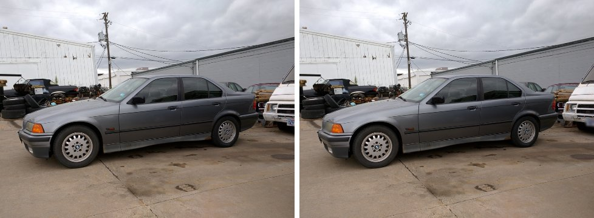

# License Plate Detection & Blurring with YOLOv8

Automatically detects vehicle license plates in images and Gaussian-blurs only the plate region, so that camera footage can be stored and shared without exposing personally identifiable information (GDPR / CCPA / DPDP).



## Results (YOLOv8s, 640 px, 30 epochs)

| Split | Precision | Recall | mAP@50 | mAP@50-95 |
|---|---|---|---|---|
| Validation (1,073 images) | 0.874 | 0.823 | 0.862 | 0.469 |
| Test (386 images) | 0.918 | 0.893 | 0.915 | 0.661 |

- **Privacy:** 89% of labelled test plates are fully covered by blur (confidence threshold 0.20, 20% box padding).
- **Speed:** detection + blur runs at about 44 FPS end to end on an RTX 3070.
- **Limitation:** recall drops to 53% for plates narrower than 16 px at model input. The full analysis and recommendations are in Section 10 of the notebook.

## Repository contents

| Path | What it is |
|---|---|
| [case_study.ipynb](case_study.ipynb) | The full case study: model selection, training, evaluation, blurring, insights |
| [runs/yolov8s_640/](runs/yolov8s_640/) | Training run: `weights/best.pt`, `results.csv`, curves, confusion matrix |
| [outputs/summary.json](outputs/summary.json) | Every key metric in machine-readable form |
| [samples/](samples/) | Before / after examples from the test set |

## Reproduce

1. Download the [Large License Plate Dataset](https://www.kaggle.com/datasets/fareselmenshawii/large-license-plate-dataset) and place it as `dataset/images/{train,val,test}` and `dataset/labels/{train,val,test}`.
2. Install the dependencies with [uv](https://docs.astral.sh/uv/): `uv sync`. `pyproject.toml` pins a CUDA 13.2 build of PyTorch on Windows/Linux; change the index URL to match your GPU driver.
3. Download the pretrained checkpoints `yolov8n.pt`, `yolov8s.pt` and `yolov8m.pt` into `weights/` (the Ultralytics assets release has them).
4. Run the notebook. Training is skipped automatically when `runs/yolov8s_640/weights/` already contains a finished run. Delete that folder to retrain (about 2 h on an RTX 3070).

## Use the trained model

```python
import cv2
from ultralytics import YOLO

model = YOLO("runs/yolov8s_640/weights/best.pt")
img = cv2.imread("car.jpg")
for x1, y1, x2, y2 in model.predict(img, conf=0.2, verbose=False)[0].boxes.xyxy.int().tolist():
    roi = img[y1:y2, x1:x2]
    k = max(3, int(max(roi.shape[:2]) * 0.5) | 1)   # kernel scales with plate size
    img[y1:y2, x1:x2] = cv2.GaussianBlur(roi, (k, k), 0)
cv2.imwrite("car_blurred.jpg", img)
```

(The notebook version also pads each box by 20% before blurring.)
